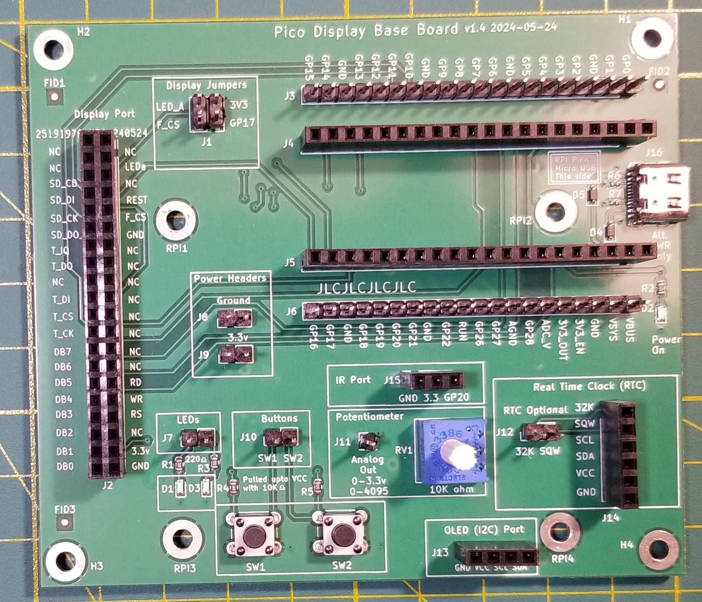

# Pico Display Base Board
 
A printed circuit board (board) using the Raspberry Pi Pico microcontroller as a base platform for projects.

```
Platform: Raspberry Pi
Board: Raspberry Pi Pico
Copyright (C) 2024 KW Services.
MIT License

Designed for PicoMite/WebMite projects.
```

# Independent Overview

Read a short overview written by Tindie Blog [click the link](https://blog.tindie.com/2024/06/pico-display-base-board/)

# Scope

The Pico Display Base Board is a printed circuit board (PCB) designed for a Raspberry Pi Pico board (“Pico”) and a SSD1963 LCD display board. The PCB can be used for generic Pico Arduino (C code) or Thonny (MicroPython) projects. The PCB is especially suited to projects requiring a medium or large LCD Display with a touchscreen and integrated SD card. The pictures are demonstrating the PCB with a five (5) inch 800*480 display.

The PCB includes various onboard components and ports for external devices. The male headers provide a flexible means to wire connections to the components. The ports have PCB connections to Pico pins and permit an easy way to simply insert the external devices. There should be no need to solder any wires nor drill holes for any parts.

The product is only the PCB. The Pico, display board, wires and the external devices are not included. However these low-cost components are available from popular online retailers.

<div align="left">
    <table >
    <tr>
        <td><b>Pico </b></td>
        <td><b>Onboard Devices</b></td>
        <td><b>External Devices</b></td>
        <td><b>Display Interface</b></td>
    </tr>
     <tr>
        <td>
        &#x2022; Holds a Pico USB Stick</br>
        &#x2022; Breakout via Male Headers</br>
        &#x2022; USB-C Port for external 5v Battery</br>
        </td>
        <td>
        &#x2022; Pushbuttons (x2)</br>
        &#x2022; Indicator LEDs (2x)</br>
        &#x2022; Potentiometer (10K ohm)</br>
        </td>
        <td>
        &#x2022; RTC board (e.g. DS3231) Port</br>
        &#x2022; Infrared Receiver (IR1838) Port</br>
        &#x2022; OLED port</br>
        </td>
        <td>
        &#x2022; SSD1963 LCD Display (800*480)</br>
        &#x2022; Touchscreen</br>
        &#x2022; SD Card</br>
        &#x2022; Optional Flash chip</br>
        </td>
     </tr>
    </table>
</div>

Pico Display Base Board




## Example with a LCD display

| Waiting to be Started.    | Waiting to be Stopped. |
| -------- | ------- |
|  | |


# PicoMite/WebMite Support
This PCB is special because of the display interface that can drive the LCD display, touchscreen and the integrated SD card. And, because of its compatibility with the PicoMite/WebMite firmware.

The PCB was designed for a project using the WebMite firmware. The PicoMite firmware provides the MMBasic language and supports all of the external devices (mentioned above). The WebMite provides the same features of PicoMite but includes additional features for the networking capabilities of the RPI Pico W. Either Pico will operate on this PCB. MMBasic extends the GW BASIC language and includes advanced graphics, PIO support, virtual and SD filesystem, seamless RTC interface, and easy-to-use interfaces to many popular sensors.

PicoMite/WebMite is available at https://geoffg.net. Authors: Peter Mather, Geoff Graham, and Mick Ames